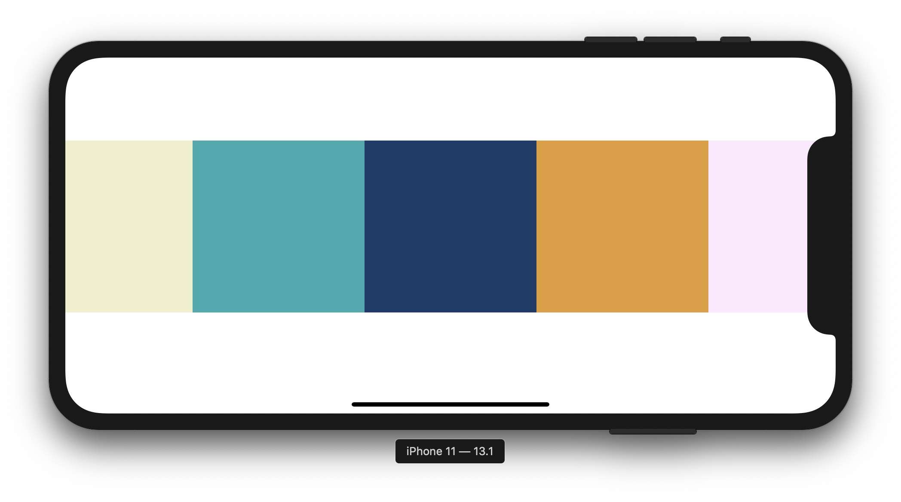

# Carousel

A simple SwiftUI carousel



## Example Usage

```
struct Parent: View {
    
    @State var colors = [
        Carousel.Item(color: Color(#colorLiteral(red: 0.9395157099, green: 0.9470053315, blue: 0.8012786508, alpha: 1))),
        Carousel.Item(color: Color(#colorLiteral(red: 0.1700480282, green: 0.6759030223, blue: 0.692445457, alpha: 1))),
        Carousel.Item(color: Color(#colorLiteral(red: 0.08263953775, green: 0.2312970459, blue: 0.4131723642, alpha: 1))),
        Carousel.Item(color: Color(#colorLiteral(red: 0.8947107196, green: 0.6190182567, blue: 0.1944372058, alpha: 1))),
        Carousel.Item(color: Color(#colorLiteral(red: 0.995511353, green: 0.9055879712, blue: 0.994179666, alpha: 1))),
        Carousel.Item(color: Color(#colorLiteral(red: 0.9775201678, green: 0.8466212153, blue: 0.2689898014, alpha: 1)))
    ]
    
    var body: some View {
        Carousel(items: $colors)
    }
    
}
```
